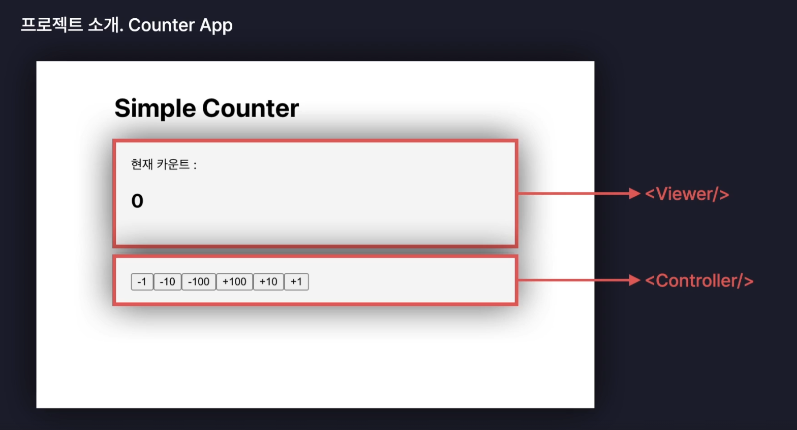

# Counter-app

## 구현 화면



## 구현 기능

1. 버튼 클릭 시 해당하는 숫자만큼 카운트 변경

**폴더구조**

```
├─ counter-app
│  ├─ README.md
│  ├─ eslint.config.js
│  ├─ index.html
│  ├─ package-lock.json
│  ├─ package.json
│  ├─ public
│  │  └─ vite.svg
│  ├─ src
│  │  ├─ App.css
│  │  ├─ App.jsx
│  │  ├─ assets
│  │  ├─ components
│  │  │  ├─ Controller.jsx
│  │  │  └─ Viewer.jsx
│  │  ├─ index.css
│  │  └─ main.jsx
│  └─ vite.config.js
```

## 추가 구현 기능

1. 버튼을 컴포넌트로 구현하기

**폴더 구조**

```
├─ counter-app
│  ├─ README.md
│  ├─ eslint.config.js
│  ├─ index.html
│  ├─ package-lock.json
│  ├─ package.json
│  ├─ public
│  │  └─ vite.svg
│  ├─ src
│  │  ├─ App.css
│  │  ├─ App.jsx
│  │  ├─ assets
│  │  ├─ components
│  │  │  ├─ Controller.jsx
│  │  │  ├─ Button.jsx
│  │  │  └─ Viewer.jsx
│  │  ├─ index.css
│  │  └─ main.jsx
│  └─ vite.config.js
```
